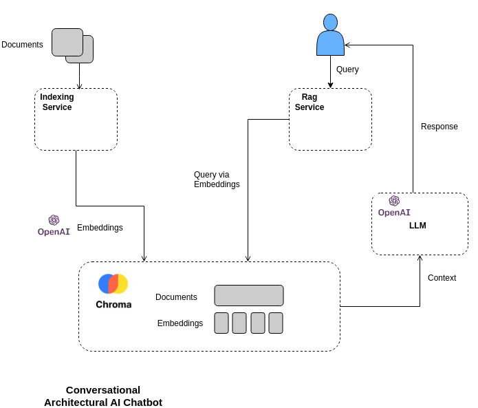

# Conversational Architectural AI Chatbot

## Overview



## Vector database

Chroma (https://docs.trychroma.com/) is a vector database that allows you to create LLM apps by making knowledge, facts, and abilities pluggable for LLM. 

 Vector database stores all the information the LLM model needs to be able to search and generate relevant outputs based on the user's query.

You can use Docker to operate a Chroma server. You may download the Chroma Docker image from Docker Hub.

### Create networking

```bash
docker network create ca-chatbot-net
```

### Run chroma database

```bash
docker pull chromadb/chroma:0.4.22.dev44

docker build ./chromadb -t ca-chatbot-chromadb:0.1

docker run --net=ca-chatbot-net -d --rm --name chromadb -p 8000:8000 -v ./chroma:/chroma/chroma -e IS_PERSISTENT=TRUE -e ANONYMIZED_TELEMETRY=TRUE ca-chatbot-chromadb:0.1
```
## Indexing Service

Our embedding service transforms information sourced from external providers into numerical vectors. This service is capable of processing data in various formats, including images, text, or audio, and converting them into lists of integers, representing the embedded features.

See more [Readme file](./indexing/README.md).

## Rag Service

Our Rag service is like your go-to problem solver when you have questions. It's all powered by LLM's function-calling magic, making sure you get the answers you need in a snap.

See more [Readme file](./rag/README.md).

## Start all services

First of all, create ./adrs and ./chroma folders.

After that, copy your adrs files to ./adrs.

Finally, run:

```bash
docker-compose up -d --build
```

## Discover the Chatbot

Explore the Conversational Architectural AI Chatbot by accessing it at http://\<your-host\>:9090 and enjoy it!. Immerse yourself in its capabilities and enjoy the interaction!
